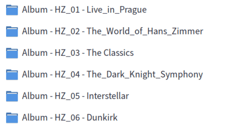
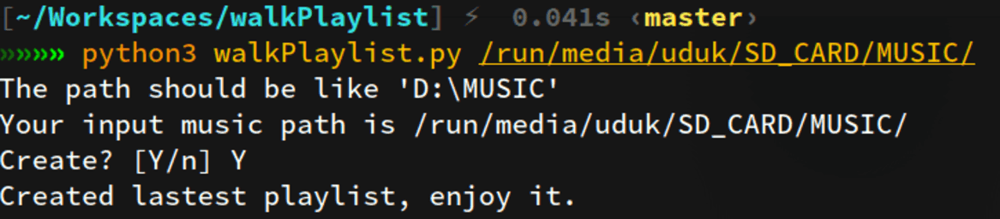
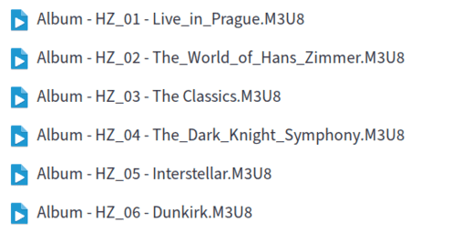

# walkPlaylist

A script for generating walkman playlist(.m3u8 files) based on folder/一个根据文件夹生成索尼 walkman 播放器的播放列表(.m3u8 格式)的脚本

## Function

The script will generates a playlist file based on the folder of each file in the path parameter/脚本会根据路径参数中的每一个文件所在的文件夹来生成播放列表文件

Please sort the music files by folders according to the playlist you want to generate/请根据你想生成的播放列表，用文件夹的方式为音乐文件分类

## Requirement

`Python3`

## Usage

```sh
chmod +x walkPlaylist.py
./walkPlaylist.py [music dir]
```

or

```sh
python3 walkPlaylist.py [music dir]
```

## Show

这是一部分分好类的文件夹：



运行脚本：



在同级目录下生成了播放列表文件：


